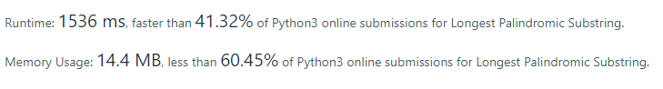

# Problem Description _[(source)](https://leetcode.com/problems/longest-palindromic-substring/)_
You have a string and want the biggest substring palyndrome.
A palyndrome is a string that doesn't change when reversed.

For example, given:

  ```"Tabata"```

your function would return:

 ``` "Tabat"```

## Problem solution
### Description:
The idea here is pretty simple: we iterate through the string. For every character, we build the biggest palyndrome possible with that character as the central character of the palyndrome. If two identical characters are next to each other, we also test the scenario that the biggest palyndrome has an even size and they are the central part.

### Complexity: 
Time: O(n^2) . For every character in the string, we iterate through both sides at least once. 
Auxiliary space: O (1). No extra space is needed 

### LeetCode stats:


_print taken on 05/11/2021_
