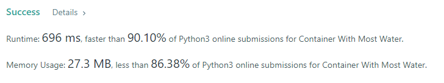

# Problem Description  _[(source)](https://leetcode.com/problems/container-with-most-water/)_
Given n non-negative integers a1, a2, ..., an , where each represents a point at coordinate (i, ai). n vertical lines are drawn such that the two endpoints of the line i is at (i, ai) and (i, 0). Find two lines, which, together with the x-axis forms a container, such that the container contains the most water.

Constraints:

* n == height.length
* 2 <= n <= 105
* 0 <= height[i] <= 104

**Example 1:**

```
Input: height = [1,8,6,2,5,4,8,3,7]
Output: 49
Explanation: The above vertical lines are represented by array [1,8,6,2,5,4,8,3,7]. 
In this case, the max area of water (blue section) the container can contain is 49.
```

**Example 2:**
```
Input: height = [1,1]
Output: 1
```
**Example 3:**
```
Input: height = [4,3,2,1,4]
Output: 16
```

## Problem solution 1 - Brute Force
### Description:

The commonly used brute force technique: test all possible areas that can be formed and returns the largest found. Easy to understand and to implement, but inneficient.

The implementation is through two nested for loops. The first one starts and the first element of the array and the following element. Then the second for iterates throguh the array comparing every remaining element to the one referenced on the first loop. If any combination makes the area bigger than the current one noted, we discard the previous largest area and note the current one as the biggest.

Taking into consideration what the question is really asking for, there isn't a single possible solution that won't be tested here so it becomes easy to understand how it will always find the correct solution even if takes more computational power.

### Complexity: 
O (n^2). On the first iteration of an array with n elements, we will compare the first element to the n-1 following elements. On the second iteration, we will compare the second element to the n-2 following elements. We continue in this way until we compare the penultimate element to the last one. In the end, we will make (n-1) + (n-2) + (n-3) + .... + 2 + 1 comparisons, which in Big O notation simplifies to O (n ^ 2).

### LeetCode stats:


## Problem Solution 3 - Two Pointers

### LeetCode stats:


_print taken on 05/11/2021_


